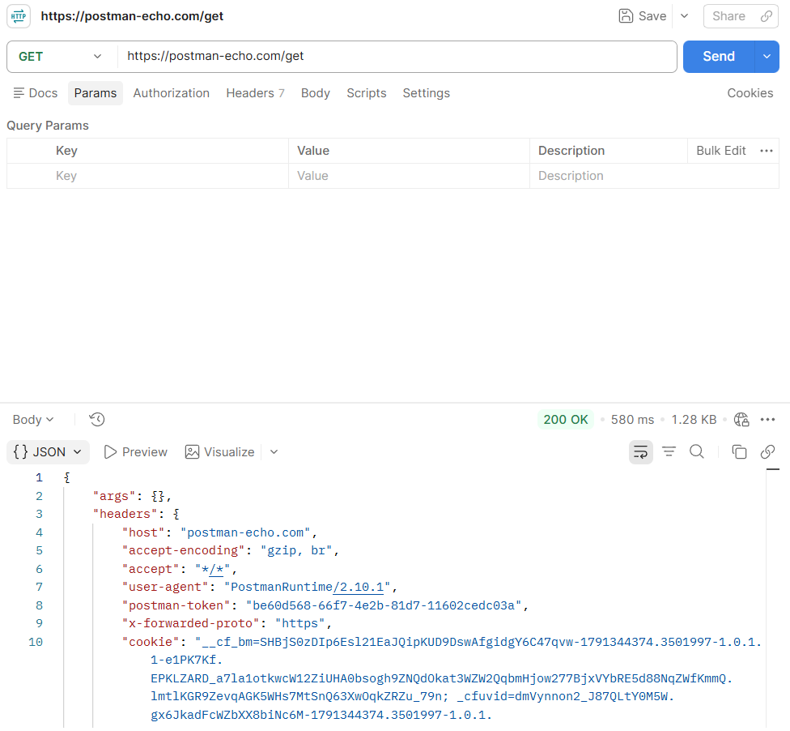
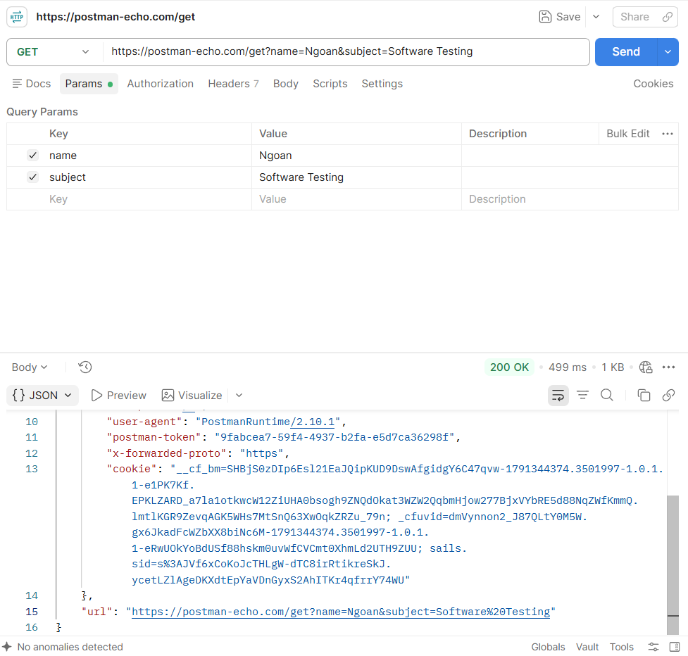
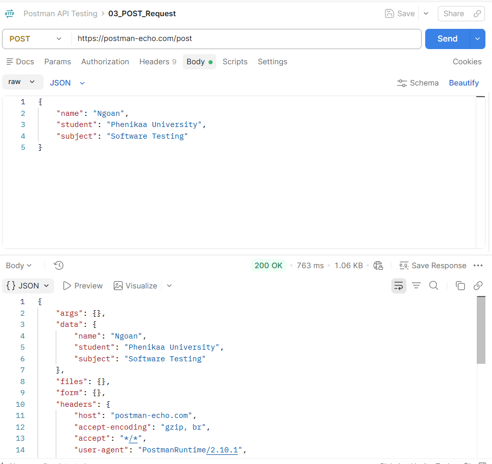

1. Giới thiệu về Postman

Postman là công cụ hỗ trợ phát triển và kiểm thử API. Postman cho phép người dùng tạo, gửi và kiểm tra các HTTP Request và Response.

Các phương thức thường sử dụng gồm: GET, POST, PUT, DELETE.

2. Giao diện Postman

Giao diện Postman gồm các khu vực chính như:

URL: Nhập địa chỉ API.
Method: Chọn phương thức HTTP.
Params: Thêm tham số.
Headers: Thiết lập Header.
Body: Nhập dữ liệu gửi đi.
Response: Xem kết quả trả về.
Tests: Viết kiểm thử tự động
## Hình ảnh thực hành

### 1. GET Request

### 2. GET Request với Parameters

### 3. POST Request

### 4. PUT Request

### 5. DELETE Request

